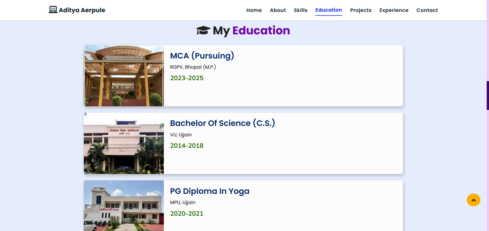
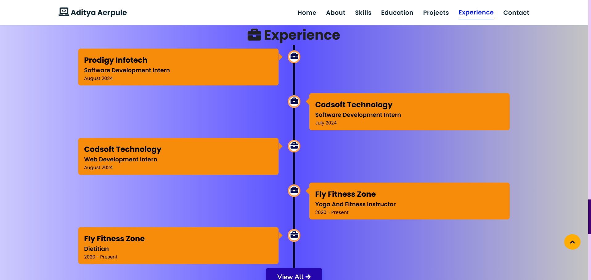

# Aditya Aerpule - Full-Stack Developer & Fitness Trainer

[](https://github.com/coder-aadii)

## 🚀 Live Preview
[Check out the live site here!](https://adityaaerpule.netlify.app)

Welcome to my portfolio website! This is a single-page web application showcasing my skills, projects, and experience. Below, you will find a detailed breakdown of each section along with instructions to add snapshots.

## Table of Contents

1. [Hero Section](#hero-section)
2. [About Me](#about-me)
3. [Skills](#skills)
4. [Education](#education)
5. [Experience](#experience)
6. [Projects](#projects)
7. [Contact Me](#contact-me)
8. [Installation](#installation)

---

## Hero Section

The **Hero Section** is the first thing users see when they land on the site. It contains a brief introduction with my name and role as a Full-Stack Developer and Fitness Trainer. The section has a background image or illustration and features links to my social media profiles (GitHub, LinkedIn, etc.).


> **Instructions:** Add a screenshot of the Hero Section here. Capture the full background, heading, and social media icons.

---

## About Me

The **About Me Section** provides a brief overview of who I am. It includes a short biography, my professional background, and a little bit about my personal interests. This section is where I talk about my journey from being a software developer to a fitness trainer, highlighting the balance between my passion for coding and my love for fitness.


> **Instructions:** Add a snapshot of the About Me section showing the heading, bio, and any accompanying image or avatar.

---

## Skills

In the **Skills Section**, I list my core competencies as a Full-Stack Developer, including:
- **Frontend**: HTML, CSS, JavaScript, React
- **Backend**: Java, Node.js, MongoDB, MySQL
- **Mobile Development**: Android (Java, Kotlin)
- **Other Tools**: Git, Docker, Firebase

This section is usually represented with skill icons or progress bars indicating proficiency levels.


> **Instructions:** Add a screenshot of the Skills Section. Make sure to capture the icons or skill bars for each technology stack.

---

## Education

The **Education Section** lists my academic qualifications. It includes my current education status (MCA from RGPV), a brief summary of the relevant courses, and any certifications or additional training I've completed.

For example:
- **Master of Computer Applications (MCA)** - RGPV, Bhopal (Pursuing)
- **PG Diploma in Yoga**
- **B.Sc. in Computer Science**



> **Instructions:** Add a snapshot of the Education Section with all degrees and certifications clearly displayed.

---

## Experience

The **Experience Section** details my professional work experience, including internships and projects. Each role is briefly described with bullet points summarizing key responsibilities and contributions.

For example:
- **Software Developer Intern - Prodigy Infotech**  
  - Developed software applications using Java.
  - Worked on backend services using MySQL.

- **Web Developer Intern - Codsoft Technology**  
  - Built responsive web pages.
  - Worked with RESTful APIs and MongoDB.



> **Instructions:** Add a snapshot of the Experience Section that shows job titles, companies, and summaries of work done.

---

## Projects

The **Projects Section** showcases my most recent and impactful work. Each project card contains:
- Project title
- Brief description
- Technologies used
- Links to the live demo and source code on GitHub

For example:

| Project Name | Description | Technologies | Live Demo / Code |
| ------------ | ----------- | ------------ | ---------------- |
| **Ping - Android Messaging App** | A real-time chat app with Firebase integration. | Android, Firebase | [View Code](https://github.com/coder-aadii/Ping-MessagingApp-Android) |
| **EleBill - Electricity Billing System** | A CRUD app for managing electricity billing. | MongoDB, HTML, CSS, JS | [Live Demo](https://ele-bill.netlify.app/) |
| **FFZ Clients Manager** | A Java Swing app to manage clients at Fly Fitness Zone. | Java Swing | [View Code](https://github.com/coder-aadii/FFZ-ClientsManager-JavaSwing) |


---

## Contact Me

In the **Contact Me Section**, users can reach out to me via a contact form or email. The section includes fields for name, email, and message, and offers alternative ways to connect (LinkedIn, GitHub, Instagram).


---

## Installation

To set up this project locally, follow these steps:

1. Clone the repository:
   ```bash
   git clone https://github.com/coder-aadii/my-portfolio.git


2. Navigate to the project directory:
    ```bash
    cd my-portfolio

3. Open index.html in your browser to view the portfolio.

---

## 🔧 Technologies Used
- **HTML**: Structured the content of the website.
- **CSS**: Designed responsive layouts, animations, and custom styling.
- **JavaScript**: Added dynamic functionality and interactivity across the portfolio.
- **CDN JS Libraries**: Utilized external JavaScript libraries like **jQuery**, **particles.js**, **FontAwesome**, and **Typed.js** for enhanced features such as icon integration, smooth scrolling, and typing animations. 
- **Git & GitHub**: Managed version control and project deployment.

---

## 📞 Contact
- **Email**: [adityaaerpule@gmail.com](mailto:adityaaerpule@gmail.com)
- **LinkedIn**: [Aditya Aerpule](https://www.linkedin.com/in/aditya-aerpule-a22062309/)
- **Instagram**: [@cod3r.aadi](https://www.instagram.com/cod3r.aadi)
- **GitHub**: [@coder-aadii](https://github.com/coder-aadii)

Feel free to reach out for collaboration or queries!